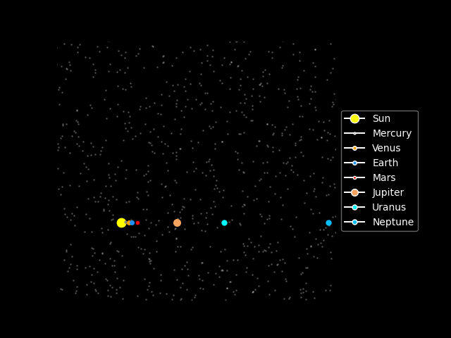
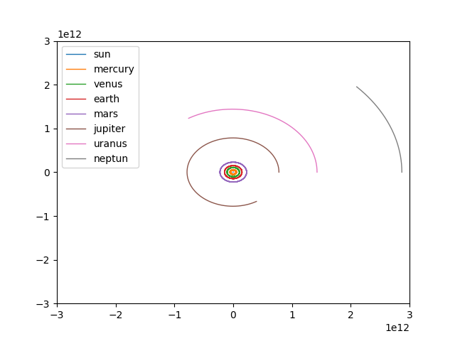

# NBody
In an N-body problem, we need to find the **positions** and **velocities** of a **collection of interacting particles** over a period of time. An n-body solver is a program that finds the solution to an n-body problem by simulating the behavior of the particles. The input to the problem is the **mass**, **position**, and **velocity** of each particle at the start of the simulation, and the output is typically the **position** and **velocity** of each particle at a sequence of user-specified times.
We’ll use **Newton’s second law of motion** and his **law of universal gravitation** to determine the positions and velocities. 
If particle q has position $s_q(t)$ at time t , and particle k has position $s_k(t)$, then the force on particle q exerted by particle k is given by:

$$
f_{qk}(t) = -\frac{G m_q m_k}{|s_q(t) - s_k(t)|^3} \cdot [s_q(t) - s_k(t)]
$$

**Verlet integration** is a numerical method used to integrate Newton's equations of motion. It is frequently used to calculate trajectories of particles in molecular dynamics simulations and computer graphics. The Verlet integrator **provides good numerical stability**, as well as other properties that are important in physical systems such as time reversibility and preservation of the symplectic form on phase space.
For a second-order differential equation of the type $\ddot{x}(t)=A(x(t))$ with initial conditions $x(t_{0})=x_{0}$ and $\dot{x}(t_{0})=v_{0}$ an approximate numerical solution $x_{n} \approx x(t_{n})$ at the times $t_{n}=t_{0}+n \Delta t$ with step size $\Delta t > 0$ can be obtained by the following method:

**Initialization:**

$$
x_1 = x_0 + v_0 \Delta t + \frac{1}{2} A(x_0) \Delta t^2
$$

**Iteration for $n = 1, 2, \dots$:**

$$
x_{n+1} = 2x_n - x_{n-1} + A(x_n) \Delta t^2
$$


## solar_system.txt

<div align="center">
  


</div>

The file to be provided within the code must have the following structure to be read consistently and correctly:
the first line contains, in order:
- **DIM** dimension of the space in which the problem is to be represented and evaluated,
- the **time variation** **$\Delta t$**, and
- the **total time interval** over which the problem is to be studied.
In our study we chose a simpler case of 2 dimension plane and a variation time delta_t of 1 day(86400 seconds) and 10 years(3.155692608e8 seconds) for the total amount of time.

After that, the following lines list the various bodies, indicating:
- their **name**
- their **mass**
- the components of the initial **position** (2 or 3 depending on the dimension chosen to represent), for which we decided to use the average distance from the Sun
- the components of the initial **tangential velocity** (always 2 or 3), for which we decided to use the average velocity of each planet.

In our case, for an initial analysis, we began by studying the case in 2 dimensions over a total time period of 10 years (total_period = 10(year)*365.2422(days per year)*24(hours per day)*60(minutes per hours)*60(seconds per minute) = 315'569'260.8 seconds) using a delta_t of 1 day = 86,400 seconds (24*60*60).


<div align="center">
 



</div>

## NVIDIA CUDA implementation

The active implementation targets NVIDIA hardware only. The former Makefile,
Metal viewer, OpenMP build path, and C++ module build have been removed.

The CUDA implementation is split into the following components:

- `gpu/cuda_kernels/globalbounding.cu` computes global spatial bounds with
  Thrust.
- `morton_leaf_groups`, `tree_builder`, and `radix_to_octree` build the radix
  representation from Morton keys.
- `octree_builder` materializes the sparse octree topology.
- `octree_physics` computes octree mass and center-of-mass data.
- `src/particle.cpp` contains the portable particle binary I/O used by the CPU
  GoogleTest.

The build currently produces the `nbody_cuda` and `nbody_particle` libraries
plus their test executables. It does not produce the retired cross-platform
simulation executable.

## Build and test requirements

For a native Linux build, install:

- an NVIDIA driver and CUDA-capable GPU;
- CUDA Toolkit with `nvcc`, CUDA Runtime, CUB, and Thrust;
- CMake 3.28 or newer and a C++20 host compiler supported by the selected CUDA
  Toolkit;
- GoogleTest with its CMake package configuration;
- Ninja when using the commands below.

CUB and Thrust are supplied by the CUDA Toolkit. The current C++/CUDA sources
do not require MPI, OpenMP, Boost, Eigen, Python, or a separately cloned CCCL
repository.

Configure, compile, and run all GoogleTests with:

```bash
cmake -S . -B build -G Ninja \
  -DBUILD_TESTING=ON \
  -DCMAKE_BUILD_TYPE=RelWithDebInfo \
  -DCMAKE_CUDA_ARCHITECTURES=80
cmake --build build --parallel
ctest --test-dir build --output-on-failure
```

Architecture `80` targets NVIDIA A100. Set `CMAKE_CUDA_ARCHITECTURES` to the
compute capability of the cluster GPU, or to a semicolon-separated CMake list
when one build must support several architectures.

To add Compute Sanitizer memcheck cases to CTest:

```bash
cmake -S . -B build -G Ninja \
  -DBUILD_TESTING=ON \
  -DNBODY_ENABLE_COMPUTE_SANITIZER_TESTS=ON \
  -DCMAKE_CUDA_ARCHITECTURES=80
cmake --build build --parallel
ctest --test-dir build --output-on-failure
```

## Singularity/Apptainer test container

`Singularity.def` defines only the test environment: CUDA 12.6.3, GCC, CMake,
Ninja, and GoogleTest. It does not contain VPN, SSH, Slurm authentication, or
cluster credentials. The host NVIDIA driver is injected only at execution time
with `--nv`.

Build the immutable SIF image on a Linux system with Apptainer:

```bash
sudo apptainer build nbody-tests.sif Singularity.def
```

The equivalent `singularity build` command can be used with SingularityCE.
Image construction does not need a GPU; CUDA execution does.

For a manual Slurm submission, first ensure `ci-results` exists because Slurm
opens the output file before starting the script:

```bash
mkdir -p ci-results
sbatch --wait \
  --partition=GPU_PARTITION \
  --account=PROJECT_ACCOUNT \
  --export=ALL,SOURCE_DIR="$PWD",IMAGE_PATH="$PWD/nbody-tests.sif",RESULTS_DIR="$PWD/ci-results",CONTAINER_RUNTIME=singularity,CUDA_ARCHITECTURES=80 \
  ci/run_gpu_tests.slurm
```

The batch script requests one NVIDIA GPU, mounts the source read-only at
`/workspace`, builds in node-local temporary storage, runs every GoogleTest via
CTest, and writes `ctest-results.xml`, configure/build/test logs, and the Slurm
output under `ci-results`.

## Automated cluster deployment

`.github/workflows/main.yml` owns the connection and deployment sequence:

1. build `nbody-tests.sif` on the GitHub Linux runner;
2. establish the GlobalProtect VPN and SSH connection;
3. transfer the tracked source archive and SIF image to a commit-specific
   cluster directory;
4. submit `ci/run_gpu_tests.slurm` and wait for its exit status;
5. download the JUnit report and logs as a GitHub Actions artifact;
6. disconnect the VPN in an `always()` cleanup step.

Configure these GitHub Actions secrets:

- `POLIMI_USER`, `POLIMI_PASSWORD`, `POLIMI_TOTP`, and `POLIMI_VPN` for the VPN;
- `SSH_PRIVATE_KEY`, `SSH_CERTIFICATE`, and `SSH_KNOWN_HOSTS` for host
  verification and SSH authentication;
- `SSH_USER` and `CLUSTER_IP_ADDRESS` for the remote login target.

Configure these repository variables as required by the target cluster:

| Variable | Required | Default | Purpose |
| --- | --- | --- | --- |
| `SLURM_PARTITION` | Yes on most clusters | empty | GPU-enabled Slurm partition, for example Leonardo `boost_usr_prod` |
| `SLURM_ACCOUNT` | Cluster-dependent | empty | Project allocation/account passed to `sbatch` |
| `SLURM_QOS` | Cluster-dependent | empty | Optional Slurm QOS |
| `CUDA_ARCHITECTURES` | No | `80` | CMake CUDA architecture; use `90` for H100 |
| `CLUSTER_PROJECT_ROOT` | No | `AMSC-Nbody-ci` | Remote directory containing commit-specific releases |
| `CLUSTER_CONTAINER_RUNTIME` | No | `singularity` | `singularity` or `apptainer` executable on compute nodes |
| `CLUSTER_CONTAINER_MODULE` | No | empty | Environment module to load when the runtime is not already available |
| `ENABLE_COMPUTE_SANITIZER` | No | `OFF` | Set to `ON` to register and execute memcheck tests |

For CINECA Leonardo, the defaults `CUDA_ARCHITECTURES=80` and
`CLUSTER_CONTAINER_RUNTIME=singularity` match its A100 nodes and Singularity
runtime; set the project-specific Slurm account and a GPU partition. Refer to
the current [CINECA container documentation](https://docs.hpc.cineca.it/services/singularity.html)
and [Leonardo partition documentation](https://docs.hpc.cineca.it/hpc/leonardo.html)
when choosing site values.

## Generate Galaxy Data
The script [data/generate_galaxy.py](data/generate_galaxy.py) creates synthetic binary datasets for the galaxy viewer and the large-particle loader.

Run it from the project root with:
```bash
python3 data/generate_galaxy.py --galaxy spiral -n 100000 -o data/milky_way_like.bin
```

Available options:
- ```--galaxy globular|spiral``` selects the base galaxy type.
- ```--shape natural|heart|smile``` changes the projected XY shape. The default is ```natural```.
- ```--num-arms N``` sets the number of spiral arms when ```--galaxy spiral``` is used. The default is ```4```.
- ```-n``` or ```--num-particles``` sets the particle count.
- ```-o``` or ```--output``` sets the output binary file path.
- ```--seed``` makes the generated dataset reproducible.

Examples:
```bash
python3 data/generate_galaxy.py --galaxy spiral --num-arms 3 -n 5000000 -o data/milky_way_like_5M.bin
python3 data/generate_galaxy.py --galaxy globular --shape heart -n 100000 -o data/globular_heart.bin
python3 data/generate_galaxy.py --galaxy spiral --shape smile -n 100000 -o data/spiral_smile.bin
```

Binary format:
- the first 8 bytes are the number of particles stored as little-endian ```uint64```
- then all ```mass``` components
- then all ```x``` coordinates
- then all ```y``` coordinates
- then all ```z``` coordinates
- then all ```vx``` coordinates
- then all ```vy``` coordinates
- then all ```vz``` coordinates

Each coordinate and velocity component is written as little-endian ```double```.

Use a writable output path such as ```data/file.bin```. A path like ```/data/file.bin``` points to a root-level directory and will usually fail with a permission error.

# The general issue we had
In our initial study with the Euler method we found a problem when representing the trajectories as they did not seem to be precise and to respect the correct progression of the planets.
For this reason we decided to adopt and study our case by applying the Verlet integration, which is a numerical method used to integrate Newton's equations of motion.
The Verlet integrator provides good numerical stability, as well as other properties that are important in physical systems such as time reversibility and preservation of the symplectic form on phase space (maintain the fundamental geometric structure of phase space intact, avoiding energy drift and ensuring long-term stability), at no significant additional computational cost over the simple Euler method.
Euler’s error tends to accumulate dramatically, often causing solutions to “blow up.”
The Verlet method, thanks to its time-symmetric structure, is much more stable, and moreover it has a smaller overall error:

•	Euler: local error of order 1 → global error O(Δt)

•	Verlet: local error of order 2 → global error O(Δt²)
